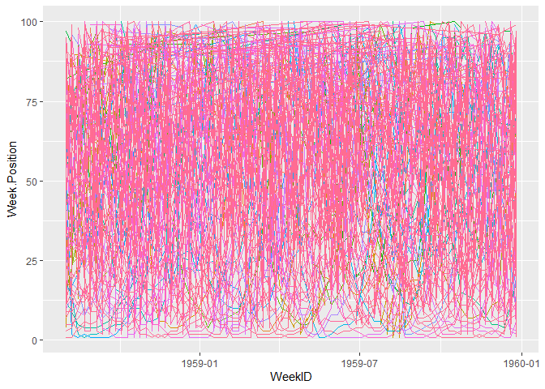

Data Science - Project
================
Michel Poupa
2021-05-21

## Intro

Music consumption through the years has highly evolved and democratized
itself. Before 1877, if someone wanted to listen to music, they either
had to know how to play it, or had to pay to go to a concert, an opera…
but this all changed with the invention of the phonograph, first way to
have a orchestra at home. It was fairly expensive and thus only the
wealthiest could access it (only a small possible audience). Through the
years, the way to listen to music got cheaper and thus more accessible,
which created a boom in the music consumption.In 2014, 93% of the US
population was listening to music more than 25 hours per week according
to Nielsen. That year, the Americans streamed 164 billion songs across
all platforms. This project will try to find what were the evolution
regarding people’s taste in music over the years by comparing a dataset
of 28500 songs from 1958 to 2020, regarding their “performance” on the
Billboard Hot 100.

## Favorite genre other the years

<!-- -->

``` r
summary(cars)
```

    ##      speed           dist       
    ##  Min.   : 4.0   Min.   :  2.00  
    ##  1st Qu.:12.0   1st Qu.: 26.00  
    ##  Median :15.0   Median : 36.00  
    ##  Mean   :15.4   Mean   : 42.98  
    ##  3rd Qu.:19.0   3rd Qu.: 56.00  
    ##  Max.   :25.0   Max.   :120.00

## Including Plots

You can also embed plots, for example:

<!-- -->

Note that the `echo = FALSE` parameter was added to the code chunk to
prevent printing of the R code that generated the plot.
